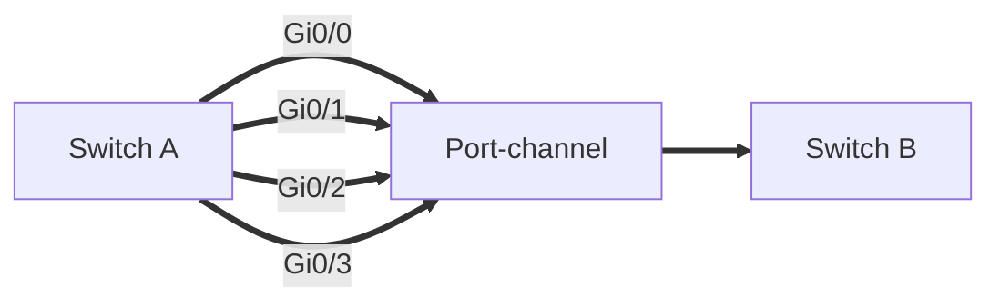
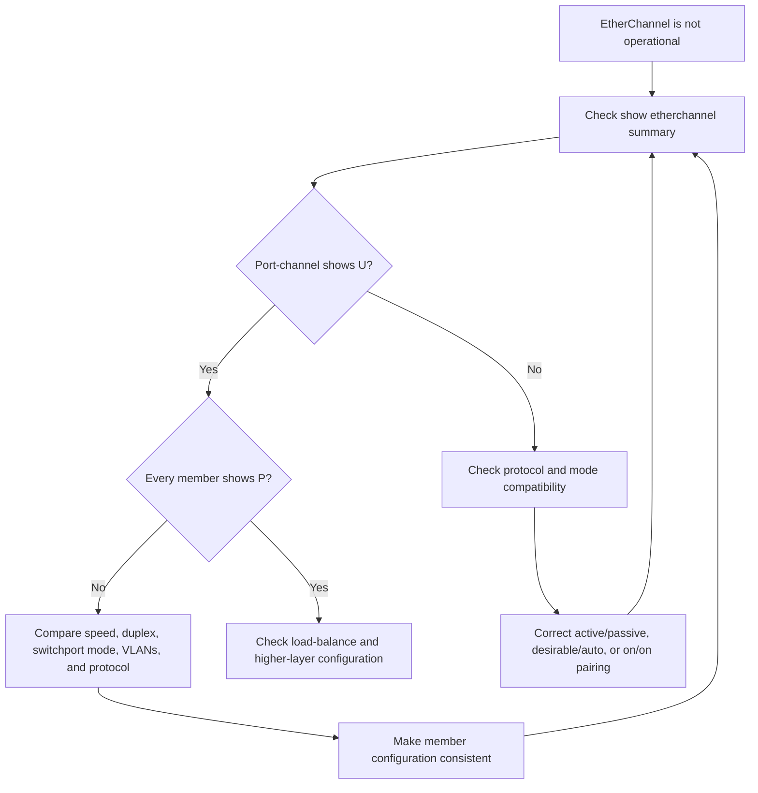

# EtherChannel: Link Aggregation

> [!summary]
> **EtherChannel** combines multiple physical Ethernet links into one logical **port-channel**. It increases aggregate bandwidth, provides link redundancy, and lets Spanning Tree treat the entire bundle as one interface. Traffic is distributed by flow, so one conversation stays on one physical member while different conversations can use different members.

## Why EtherChannel is needed

### Oversubscription

Access switches often have many end-host connections sharing a smaller uplink toward a distribution switch. When the total potential access-layer bandwidth exceeds the uplink bandwidth, the link is **oversubscribed**.

Some oversubscription is normal. Excessive oversubscription causes:

- Congestion
- Queuing and delay
- Packet loss
- Poor application performance

Adding parallel links appears to solve the bandwidth problem, but ordinary Layer 2 links create another issue.

### The Spanning Tree problem

If two switches are connected by several independent Layer 2 links:

- STP normally allows one link to forward.
- STP blocks the redundant links to prevent a Layer 2 loop.
- The blocked links provide failover but do not add usable bandwidth.
- If every link forwarded independently, broadcast storms could occur.

EtherChannel solves this by presenting the parallel links to STP as **one logical interface**.

## What EtherChannel provides

EtherChannel groups physical interfaces into a logical interface called a:

- **Port-channel**
- **Link Aggregation Group (LAG)**
- **EtherChannel**

Benefits include:

- Increased aggregate bandwidth
- Redundancy if a member link fails
- Load distribution across active members
- One logical STP interface instead of several separate links
- Simplified configuration on the port-channel interface



> [!important]
> EtherChannel increases total capacity across multiple flows. A single flow normally uses only one physical member, so one conversation does not automatically receive the combined bandwidth of every link.

## EtherChannel load balancing

EtherChannel balances traffic by **flow**, not by alternating individual frames.

A flow is a conversation between two network nodes. Frames belonging to the same flow stay on the same physical member so they arrive in order.

If frames from one flow were sent over different links, differences in delay could cause out-of-order delivery.

### Hash inputs

Cisco switches can select a member link using combinations of:

- Source MAC address
- Destination MAC address
- Source and destination MAC addresses
- Source IP address
- Destination IP address
- Source and destination IP addresses

The switch applies a hashing calculation to the selected fields. The result maps the flow to one active physical interface.

### Configure and verify the load-balancing method

```cisco
show etherchannel load-balance
```

```cisco
port-channel load-balance method
```

Common methods shown in the deck:

```text
src-mac
dst-mac
src-dst-mac
src-ip
dst-ip
src-dst-ip
```

Example:

```cisco
port-channel load-balance src-dst-mac
```

> [!tip]
> A method using both source and destination usually creates better distribution when many hosts communicate with many destinations. The best choice depends on the traffic pattern and switch model.

## EtherChannel formation methods

Cisco switches support three methods:

| Method | Standard | Negotiates? | Modes |
|---|---|---:|---|
| **PAgP** | Cisco proprietary | Yes | `desirable`, `auto` |
| **LACP** | IEEE 802.3ad | Yes | `active`, `passive` |
| **Static** | No negotiation protocol | No | `on` |

### PAgP

**Port Aggregation Protocol (PAgP)** is Cisco proprietary.

| Side A | Side B | Forms? |
|---|---|---:|
| `desirable` | `desirable` | Yes |
| `desirable` | `auto` | Yes |
| `auto` | `auto` | No |

- `desirable` actively negotiates.
- `auto` waits for the neighbor to initiate.

### LACP

**Link Aggregation Control Protocol (LACP)** is the industry-standard negotiation protocol.

| Side A | Side B | Forms? |
|---|---|---:|
| `active` | `active` | Yes |
| `active` | `passive` | Yes |
| `passive` | `passive` | No |

- `active` actively sends LACP negotiation messages.
- `passive` responds but does not initiate.

### Static EtherChannel

Static EtherChannel uses `on` mode and performs no negotiation.

| Side A | Side B | Forms correctly? |
|---|---|---:|
| `on` | `on` | Yes |
| `on` | `active` | No |
| `on` | `desirable` | No |

> [!warning]
> Static mode cannot detect many configuration or cabling mistakes through negotiation. Use LACP when possible unless the design specifically requires static aggregation.

## Member and protocol limits

- Up to **8 physical interfaces** can actively forward in one EtherChannel.
- LACP can associate up to **16 interfaces** with the channel.
- With 16 LACP links, 8 are active and up to 8 remain hot standby.

## Channel-group numbers

Add a member interface with:

```cisco
channel-group number mode mode
```

Example:

```cisco
channel-group 1 mode active
```

Rules:

- All members of one EtherChannel on the same switch use the same channel-group number.
- The number does not have to match on the remote switch.
- `channel-group 1` on one switch can connect to `channel-group 2` on the neighbor.
- The local group number normally creates the matching logical interface, such as `Port-channel1`.

## Manually select the negotiation protocol

The `channel-protocol` command restricts the interface to one negotiation protocol:

```cisco
channel-protocol lacp
```

or:

```cisco
channel-protocol pagp
```

After selecting LACP, PAgP and static `on` modes are rejected as protocol mismatches. Use the matching channel-group modes:

- LACP: `active` or `passive`
- PAgP: `desirable` or `auto`

## Member-interface requirements

Physical members must use compatible configurations.

Required matches include:

- Speed
- Duplex
- Switchport mode: access or trunk
- Access VLAN, when operating as access ports
- Native VLAN, when operating as trunks
- Allowed VLAN list, when operating as trunks
- EtherChannel negotiation method

If a member is inconsistent, the switch excludes or suspends it rather than safely bundling it.

> [!best-practice]
> Configure member interfaces together with `interface range`, then place shared Layer 2 or Layer 3 settings on the logical port-channel.

## Configure a Layer 2 EtherChannel

### LACP trunk example

Configure the members on the first switch:

```cisco
interface range g0/0 - 3
 switchport mode trunk
 channel-group 1 mode active
```

Configure the logical interface:

```cisco
interface port-channel 1
 switchport mode trunk
```

Configure the neighbor using a compatible mode:

```cisco
interface range g0/0 - 3
 switchport mode trunk
 channel-group 1 mode active
```

`active` plus `passive` would also form successfully.

### PAgP example

```cisco
interface range g0/0 - 3
 switchport mode trunk
 channel-group 1 mode desirable
```

The neighbor can use `desirable` or `auto`.

### Static example

```cisco
interface range g0/0 - 3
 switchport mode trunk
 channel-group 1 mode on
```

The neighbor must also use `on`.

### Configure shared trunk settings

Apply settings such as the native VLAN and allowed VLAN list consistently:

```cisco
interface port-channel 1
 switchport mode trunk
 switchport trunk native vlan 99
 switchport trunk allowed vlan 10,20,30,99
```

Verify:

```cisco
show interfaces trunk
```

The output should list the logical interface, such as `Po1`, as the trunk.

## STP and EtherChannel

STP treats the port-channel as one logical link.

```cisco
show spanning-tree
```

Instead of listing each physical member separately, the topology displays an interface such as:

```text
Po1  Desg  FWD
```

If one physical member fails, the port-channel can remain forwarding through the surviving members without an STP topology change.

## Configure a Layer 3 EtherChannel

A Layer 3 EtherChannel is a routed logical link between multilayer switches.

Important rules:

- Convert the physical members to routed ports with `no switchport`.
- Do not assign IP addresses to the physical members.
- Assign the IP address to the `Port-channel` interface.
- Both ends must use addresses from the same subnet.

Example for ASW1:

```cisco
interface range g0/0 - 3
 no switchport
 channel-group 1 mode active
```

```cisco
interface port-channel 1
 ip address 10.0.0.1 255.255.255.252
 no shutdown
```

Example for DSW1:

```cisco
interface range g0/0 - 3
 no switchport
 channel-group 1 mode active
```

```cisco
interface port-channel 1
 ip address 10.0.0.2 255.255.255.252
 no shutdown
```

Verify:

```cisco
show ip interface brief
```

The logical `Port-channel1` should show the configured address and an `up/up` state.

## Verification commands

### `show etherchannel summary`

```cisco
show etherchannel summary
```

This is the quickest overall health check.

Healthy Layer 2 LACP example:

```text
Po1(SU)  LACP  Gi0/0(P) Gi0/1(P) Gi0/2(P) Gi0/3(P)
```

Interpretation:

- `S`: Layer 2 port-channel
- `U`: Port-channel is in use
- `P`: Physical member is bundled in the port-channel

Healthy Layer 3 LACP example:

```text
Po1(RU)  LACP  Gi0/0(P) Gi0/1(P) Gi0/2(P) Gi0/3(P)
```

- `R`: Layer 3 port-channel
- `U`: In use

### Important summary flags

| Flag | Meaning |
|---|---|
| `D` | Down |
| `P` | Bundled in the port-channel |
| `I` | Stand-alone |
| `s` | Suspended |
| `H` | Hot standby, LACP only |
| `R` | Layer 3 |
| `S` | Layer 2 |
| `U` | In use |
| `N` | Not in use; no aggregation |
| `f` | Failed to allocate aggregator |
| `M` | Not in use; minimum links not met |
| `m` | Not aggregated because minimum links were not met |
| `u` | Unsuitable for bundling |
| `w` | Waiting to be aggregated |
| `d` | Default port |
| `A` | Formed by Auto LAG |

Common problem examples:

- `Po1(SD)`: Layer 2 port-channel is down.
- Member `(D)`: Physical interface is down.
- Member `(s)`: Interface is suspended, commonly due to a mismatch.
- Member `(I)`: Interface is operating stand-alone rather than bundled.

### `show etherchannel port-channel`

```cisco
show etherchannel port-channel
```

This provides detailed information including:

- Channel group
- Port-channel name
- Negotiation protocol
- Number of member ports
- Active member list
- Time since each port was bundled or unbundled

### Additional useful commands

```cisco
show etherchannel load-balance
show interfaces trunk
show spanning-tree
show ip interface brief
```

## Troubleshooting workflow



### Frequent causes of failure

- LACP `passive` on both ends
- PAgP `auto` on both ends
- Static `on` paired with a negotiation mode
- PAgP paired with LACP
- Different speed or duplex
- Access mode on one member and trunk mode on another
- Different native or allowed VLANs
- A member is shut down
- Layer 2 configuration mixed with `no switchport`

## Quiz review

### Quiz 1

Which mode combinations form an operational EtherChannel?

**Correct answers: A, C, and G**

- `on - on`
- `desirable - auto`
- `active - active`

Why the others fail:

- `passive - passive`: neither side initiates LACP.
- `auto - auto`: neither side initiates PAgP.
- `active - desirable`: LACP and PAgP mismatch.
- `on - desirable`: static and PAgP mismatch.

### Quiz 2

What does `(P)` beside a physical interface mean?

**Correct answer: B - The interface is bundled in the port-channel.**

`P` does not mean passive. LACP passive is a configuration mode, while the summary flag confirms the member is successfully bundled.

### Quiz 3

Which member parameters must match?

**Correct answers: Interface speed and switchport mode.**

The deck also emphasizes matching duplex and, for trunks, native and allowed VLAN settings.

## Exam traps and practical takeaways

- Parallel Layer 2 links are normally blocked individually by STP.
- EtherChannel makes the links appear as one logical STP interface.
- Load balancing is per flow, not per frame.
- One flow normally uses one physical member.
- PAgP is Cisco proprietary; LACP is the industry standard.
- LACP `active + passive` works; `passive + passive` does not.
- PAgP `desirable + auto` works; `auto + auto` does not.
- Static `on` works only with `on`.
- PAgP, LACP, and static modes cannot be mixed.
- Up to 8 members actively forward; LACP can keep 8 additional links in standby.
- Local member interfaces must use the same channel-group number.
- The remote switch can use a different channel-group number.
- Member speed, duplex, switchport mode, and VLAN settings must match.
- `P` means successfully bundled.
- `S` identifies Layer 2; `R` identifies Layer 3.
- `U` means the port-channel is in use.
- A routed EtherChannel uses `no switchport` on the physical members.
- The Layer 3 address belongs on the port-channel, not its members.

## Quick command reference

```cisco
port-channel load-balance method
show etherchannel load-balance

interface range g0/0 - 3
 channel-group 1 mode {desirable | auto | active | passive | on}

show etherchannel summary
show etherchannel port-channel
show spanning-tree
```

## Related notes

- [[Rapid Spanning Tree Protocol (RSTP)]]
- [[STP Part 2 - Port States, Timers, Toolkit, and Configuration]]
- [[VLANs Part 2 - Trunks, 802.1Q, and ROAS]]
- [[DTP & VTP - Slide Summary]]