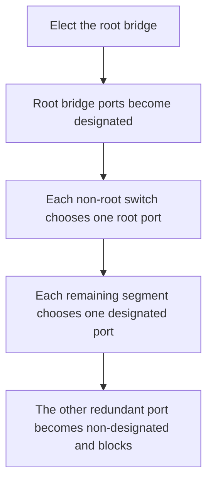

# STP Part 1: Redundancy, Root Bridge, and Port Roles

> [!summary]
> Network redundancy improves availability, but redundant Layer 2 links can create switching loops. **Spanning Tree Protocol (STP)** prevents these loops by building one loop-free forwarding path and placing selected backup ports into a blocking state. Classic STP makes its decisions by electing a **root bridge**, choosing one **root port** on every non-root switch, and selecting one **designated port** per network segment.

## Why networks need redundancy

Modern networks are expected to remain available continuously. If a single component fails, another component or path should take over with little or no downtime.

Redundancy can be added at multiple points:

- Multiple Internet or WAN connections
- Multiple routers
- Multiple switches
- Multiple links between switches
- Multiple server network interface cards (NICs)

Most endpoint PCs have only one NIC and connect to one access switch. Important servers often have multiple NICs and can connect to multiple switches.

> [!warning] The Layer 2 tradeoff
> Adding redundant switch links creates multiple paths. Without a loop-prevention protocol, Ethernet frames can circulate indefinitely.

## What goes wrong in a Layer 2 loop

### Broadcast storms

An ARP request is sent to the broadcast destination MAC address `FFFF.FFFF.FFFF`. A switch floods the frame out every interface except the one on which it arrived.

In a looped topology:

1. Each switch floods the broadcast.
2. Neighboring switches receive multiple copies.
3. Those switches flood the copies again.
4. The frames continue circulating and multiplying.

Ethernet headers do **not** have a Time to Live (TTL) field. Unlike an IP packet crossing routers, a looping Ethernet frame has no Layer 2 counter that naturally expires. Enough accumulated frames can consume the available bandwidth and prevent legitimate traffic from using the network. This condition is a **broadcast storm**.

### MAC address flapping

Switches learn a source MAC address from the interface on which a frame arrives. In a loop, copies of the same frame repeatedly arrive on different interfaces, so the switch constantly rewrites the MAC address table entry for the same source MAC.

This repeated movement of a MAC address between interfaces is **MAC address flapping**. It makes frame forwarding unstable and is another symptom of a Layer 2 loop.

## STP fundamentals

- Classic STP is standardized as **IEEE 802.1D**.
- STP uses the historical term **bridge**, but in modern networks this means a switch.
- Switches exchange STP control messages called **Bridge Protocol Data Units (BPDUs)**.
- The default Hello BPDU interval shown in the deck is **2 seconds**.
- A switch that receives a Hello BPDU knows the link leads to another STP-speaking switch. PCs and routers do not normally generate STP Hello BPDUs.
- After convergence, the root bridge originates BPDUs and the other switches forward the root's information.

STP creates a loop-free logical topology by assigning ports one of the roles covered in this lesson:

| Port role | State in this lesson | Purpose |
|---|---|---|
| **Root port (R)** | Forwarding | Best path from a non-root switch toward the root bridge |
| **Designated port (D)** | Forwarding | Best forwarding port on a network segment |
| **Non-designated port (N)** | Blocking | Redundant port that prevents a Layer 2 loop |

A forwarding port sends and receives normal traffic. A blocking port does not forward ordinary traffic, but it still participates in STP by processing BPDUs. If an active path fails, STP can reconverge and use a previously blocked redundant path.



## Step 1: Elect the root bridge

Every switch initially assumes it is the root. A switch gives up that claim when it receives a **superior BPDU**, meaning a BPDU advertising a lower Bridge ID.

The switch with the **lowest Bridge ID (BID)** becomes the root bridge.

### Bridge ID components

The Bridge ID contains:

| Component | Size | Comparison rule |
|---|---:|---|
| Bridge priority field | 16 bits | Lowest value wins |
| MAC address | 48 bits | Lowest MAC wins if the priority fields tie |

On Cisco switches using **PVST (Per-VLAN Spanning Tree)**, the 16-bit priority field is divided into:

- A 4-bit configurable bridge priority
- A 12-bit **Extended System ID**, which is the VLAN ID

PVST runs a separate STP instance in each VLAN. A port can therefore have different STP roles in different VLANs.

### Default and valid priority values

The default configurable priority is `32768`. The VLAN ID is added as the Extended System ID, so the effective priority for VLAN 1 is:

```text
32768 + 1 = 32769
```

Because only the upper 4 bits are configurable, the bridge priority can be changed only in increments of `4096`.

Valid configurable values are:

```text
0, 4096, 8192, 12288, 16384, 20480, 24576, 28672,
32768, 36864, 40960, 45056, 49152, 53248, 57344, 61440
```

The VLAN ID is then added to the configured value to form the priority field shown in the BID.

### Root bridge election rule

Compare switches in this order:

1. Lowest priority field, including the Extended System ID
2. If tied, lowest MAC address

All ports on the elected root bridge become **designated ports** and operate in the forwarding state.

> [!example] Quiz 1
> SW1 and SW3 both advertise priority `12289`, which is lower than the other switches. Their priorities tie, so compare MAC addresses. SW3's `014A.3821.2981` is lower than SW1's `014A.38F1.BA81`; therefore, **SW3 is the root bridge**.

> [!example] Quiz 2
> SW4 advertises priority `4097`, lower than SW3's `12289`, SW1's `16385`, and SW2's `32769`; therefore, **SW4 is the root bridge**. No MAC-address comparison is needed.

## Step 2: Select each non-root switch's root port

Every non-root switch selects exactly **one root port**. This is the switch's best path toward the root bridge, and it operates in the forwarding state.

### Classic STP path costs used in the deck

| Link speed | STP cost |
|---:|---:|
| 10 Mbps | 100 |
| 100 Mbps | 19 |
| 1 Gbps | 4 |
| 10 Gbps | 2 |

The root bridge advertises a root cost of `0`. A receiving switch adds the cost of its local receiving interface to the advertised cost.

Example with Gigabit Ethernet:

```text
Direct path:  advertised cost 0 + local interface cost 4 = root cost 4
Two-hop path: advertised cost 4 + local interface cost 4 = root cost 8
```

### Root port tie-breakers

Choose the root port by comparing candidate paths in this order:

1. Lowest total root cost
2. Lowest neighbor Bridge ID
3. Lowest neighbor Port ID

The port on the other end of a root port must be designated. Blocking that opposite port would break the non-root switch's selected path to the root.

> [!important] Neighbor information breaks the tie
> When two local ports have equal root cost, compare the **neighbor's** Bridge ID. If both paths lead to the same neighbor, compare the **neighbor's Port IDs** - not the local Port IDs.

### Port ID

The deck defines the Port ID as:

```text
Port ID = port priority + port number
```

The default port priority is `128`. In `show spanning-tree`, values such as `128.1`, `128.2`, and `128.3` identify the port priority and port number. The lowest Port ID wins a tie.

> [!example] Quiz 3
> SW2 is the root because its priority `12289` is the lowest. SW3 has two equal-cost paths to SW2: one through SW1 and one through SW4. SW1 and SW4 both have the same priority, but SW1 has the lower MAC address and therefore the lower neighbor BID. SW3 selects the port toward **SW1** as its root port.

> [!example] Quiz 4
> SW3 has two equal-cost links to the same neighbor, SW1. Because the root cost and neighbor BID are identical, SW3 compares SW1's port IDs. The link connected to SW1's **G0/1** wins because it has a lower neighbor Port ID than SW1's G0/2.

## Step 3: Select the designated port on each remaining segment

Every collision domain or point-to-point link must have one **designated port**. After the root ports have been selected, determine the designated port on each remaining segment.

Compare the two switches attached to the segment:

1. The port on the switch with the lowest root cost becomes designated.
2. If root costs tie, the port on the switch with the lowest Bridge ID becomes designated.
3. The other port becomes non-designated and enters the blocking state.

This produces one active path through the Layer 2 topology while preserving redundant links as backups.

## Full STP decision procedure

Use this order on CCNA topology questions:

1. **Find the root bridge.** Compare BID priority first, then MAC address.
2. **Mark every root-bridge port D.** All root ports are designated and forward.
3. **Choose one R port on each non-root switch.** Compare root cost, neighbor BID, then neighbor Port ID.
4. **Mark the port opposite each R port D.** The root path must remain usable.
5. **Resolve every remaining link.** Lower root cost wins D; if tied, lower BID wins D.
6. **Mark the other side N.** Non-designated ports block.
7. **Sanity-check the result.** Every non-root switch has one R port, every segment has one D port, and the forwarding topology contains no Layer 2 loop.

## Worked final quiz takeaways

### Quiz 5: Parallel links and neighbor Port ID

All switches use priority `32769`, so MAC addresses elect **SW3** as the root bridge.

- SW3's G0/0 and G0/1 are designated.
- SW1's G0/1 toward SW3 is its root port.
- SW4's G0/0 toward SW3 is its root port.
- SW2 has two equal-cost links through SW1. It chooses the link connected to SW1's lower Port ID as its root path; the other parallel link blocks.
- The SW2-SW4 link also blocks on SW2 because SW4 has a lower root cost than SW2 on that segment.

### Quiz 6: Link speed changes the best path

SW4 has priority `20481`, lower than the other switches, so **SW4 is the root bridge**.

- SW4's three connected ports are designated.
- SW2 selects G0/0 toward SW4 as its root port; its parallel G0/1 link blocks because it reaches a higher neighbor Port ID.
- SW3 selects G0/1 toward SW4 as its root port.
- SW1 selects its Gigabit path through SW3 as its root port. That path has a lower cost than the Fast Ethernet paths through SW2.
- SW2 is designated on both Fast Ethernet links to SW1 because SW2 has the lower root cost; both corresponding SW1 Fast Ethernet ports are non-designated and block.

The key lesson is that STP chooses the **lowest accumulated cost**, not the path that looks shortest on the diagram.

## Verification command

```cisco
show spanning-tree
```

Use the output to verify:

- The Root ID and local Bridge ID
- The root path cost
- The root port
- Each interface's role and state
- Port IDs such as `128.1`

## Quick review

- Redundant Layer 2 links can cause broadcast storms and MAC address flapping.
- Ethernet has no Layer 2 TTL, so looping frames do not expire naturally.
- STP uses BPDUs to build a loop-free logical topology.
- The lowest Bridge ID becomes the root bridge.
- BID comparison uses priority first and MAC address second.
- PVST includes the VLAN ID as the Extended System ID and runs STP per VLAN.
- Bridge priority changes in increments of `4096`.
- All root-bridge ports are designated and forwarding.
- Each non-root switch has exactly one root port.
- Root port order: lowest root cost, lowest neighbor BID, lowest neighbor Port ID.
- Each segment has one designated port.
- The redundant non-designated port blocks.
- Lower STP cost is preferred; faster links normally have lower cost.

## Related notes

- VLANs Part 1 - LANs, Broadcast Domains, and Access Ports
- VLANs Part 2 - Trunks, 802.1Q, and ROAS
- DTP & VTP - Slide Summary
