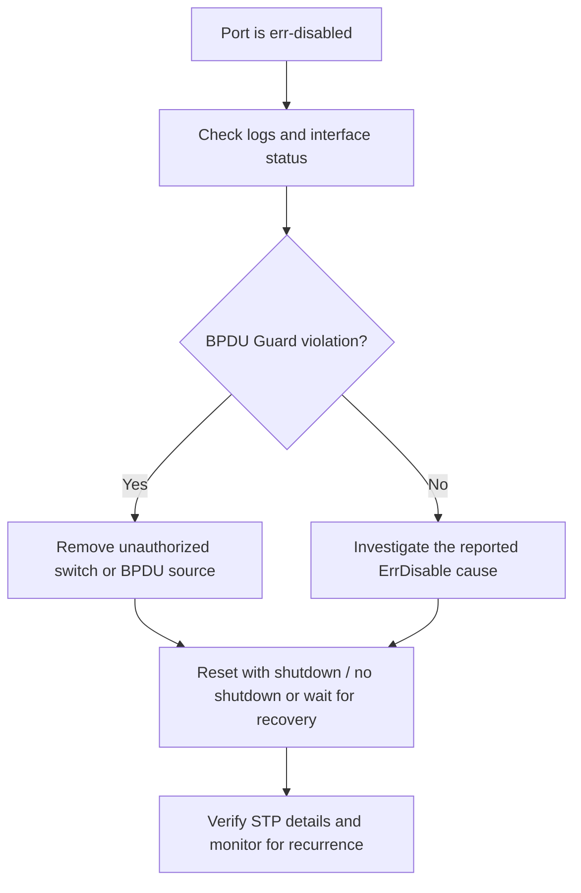

# BPDU Guard, BPDU Filter, and ErrDisable

> [!summary]
> A PortFast edge port still participates in STP. **BPDU Guard** protects the topology by error-disabling an edge port that receives a BPDU. **BPDU Filter** suppresses BPDUs, but its behavior and risk depend on whether it is configured per interface or as a PortFast default. Per-interface BPDU Filter ignores received BPDUs and effectively disables STP on the port, so it must be used with extreme caution.

## PortFast does not disable STP

PortFast makes an edge port enter the Forwarding state immediately, but STP remains active.

- The PortFast port continues sending BPDUs every 2 seconds.
- A true end host normally does not send BPDUs.
- Without BPDU Guard, a PortFast port that receives a BPDU stops behaving as an edge port and reverts to normal STP operation.
- The received BPDU may therefore change port roles or even the root-bridge election.

```cisco
interface g0/1
 spanning-tree portfast

do show spanning-tree interface g0/1 detail
```

The detailed output includes BPDU counters:

```text
The port is in the portfast edge mode
BPDU: sent 77, received 0
```

## Why BPDU Guard is needed

An access port intended for a workstation might be exposed through a wall jack. If a user connects an unmanaged or unauthorized switch, that device starts sending BPDUs into the production topology.

Possible consequences include:

- A change to the root bridge
- New root, designated, or blocked port selections
- An unexpected Layer 2 path
- A temporary or persistent switching loop
- Loss of network connectivity

PortFast alone does not prevent this. It simply falls back to normal STP when it hears a BPDU.

## BPDU Guard

BPDU Guard treats any received BPDU as evidence that an edge port is connected to a switch or bridge.

When a BPDU Guard-enabled port receives a BPDU:

1. The switch reports a BPDU Guard violation.
2. The interface enters the **error-disabled** state.
3. The physical and line protocol states go down.
4. The unauthorized device is isolated from the STP topology.

The port continues sending BPDUs while healthy; receiving one triggers the protection.

> [!best-practice]
> PortFast and BPDU Guard are normally used together on end-host-facing ports. PortFast gives immediate forwarding, while BPDU Guard prevents an attached switch from joining or influencing STP.

### Configure BPDU Guard on one interface

```cisco
interface g0/1
 spanning-tree bpduguard enable
```

Per-interface BPDU Guard can be configured independently of PortFast.

### Enable BPDU Guard by default

```cisco
spanning-tree portfast bpduguard default
```

On modern IOS, the command may include the optional `edge` keyword:

```cisco
spanning-tree portfast edge bpduguard default
```

The default form activates BPDU Guard on all PortFast-enabled ports.

Disable the default on one interface when necessary:

```cisco
interface g0/1
 spanning-tree bpduguard disable
```

### Verify BPDU Guard

```cisco
show spanning-tree interface g0/1 detail
```

Look for one of these lines:

```text
Bpdu guard is enabled
Bpdu guard is enabled by default
```

## ErrDisable

**ErrDisable** is a Cisco protection mechanism that shuts down an interface after certain violations. BPDU Guard is one possible trigger; others include port-security, Dynamic ARP Inspection, and power-policing violations.

Typical messages from a BPDU Guard violation include:

```text
Received BPDU on port GigabitEthernet0/1 with BPDU Guard enabled. Disabling port.
bpduguard error detected on Gi0/1, putting Gi0/1 in err-disable state
```

Verify the interface condition:

```cisco
show interfaces g0/1
```

Expected status:

```text
GigabitEthernet0/1 is down, line protocol is down (err-disabled)
```

> [!warning]
> Fix the underlying cause before restoring the interface. If the switch or other BPDU source is still connected, the port will immediately be error-disabled again.

### Manual recovery

After removing the offending device or correcting the topology:

```cisco
interface g0/1
 shutdown
 no shutdown
```

### Automatic ErrDisable Recovery

ErrDisable Recovery is disabled by default for BPDU Guard. Enable it for that cause:

```cisco
errdisable recovery cause bpduguard
```

The default recovery interval is **300 seconds**, or 5 minutes. Change it if required:

```cisco
errdisable recovery interval seconds
```

Example:

```cisco
errdisable recovery interval 600
```

Verify recovery settings and countdowns:

```cisco
show errdisable recovery
```

The output shows:

- Which causes have recovery enabled
- The configured recovery interval
- Interfaces waiting for automatic recovery
- The remaining time for each interface

## BPDU Filter

BPDU Filter suppresses BPDU transmission. It can reduce unnecessary BPDU exposure to end devices, but it removes or weakens an important STP safety mechanism.

> [!danger] Configuration scope changes the behavior
> Per-interface BPDU Filter and global PortFast BPDU Filter are not equivalent. The per-interface form ignores received BPDUs and effectively disables STP. The global default form backs off and restores normal STP if a BPDU arrives.

### Per-interface BPDU Filter

```cisco
interface g0/1
 spanning-tree bpdufilter enable
```

Behavior:

- The port does not send BPDUs.
- The port ignores received BPDUs.
- STP is effectively disabled on the port.
- A connected switch can create a loop without STP detecting it.

Use this form only with a very specific, well-understood design requirement.

### Default BPDU Filter on PortFast ports

```cisco
spanning-tree portfast bpdufilter default
```

Modern IOS may include `edge`:

```cisco
spanning-tree portfast edge bpdufilter default
```

Behavior:

- BPDU Filter becomes active on PortFast-enabled ports.
- The port initially does not send BPDUs.
- If a BPDU is received, PortFast and BPDU Filter are disabled on that port.
- The interface then operates as a normal STP port and processes BPDUs.

Disable the global default on one interface:

```cisco
interface g0/1
 spanning-tree bpdufilter disable
```

The global default is safer than the per-interface `enable` command because unexpected BPDUs restore normal STP behavior instead of being ignored.

## BPDU Guard and BPDU Filter together

Both features can be configured on the same port, but the result depends on how BPDU Filter was enabled.

| BPDU Filter configuration | When a BPDU arrives | BPDU Guard result |
|---|---|---|
| Global PortFast default | BPDU Filter and PortFast deactivate; the BPDU is processed | BPDU Guard triggers and error-disables the port |
| Per-interface `bpdufilter enable` | The BPDU is ignored | BPDU Guard does not see the BPDU and does not trigger |

This is why the deck recommends:

1. Enable PortFast and BPDU Guard per port or by default.
2. If BPDU Filter is needed, prefer the global PortFast default.
3. Avoid per-interface BPDU Filter unless there is a compelling design reason.

## Guard versus Filter

| Feature | Sends BPDUs? | Reaction to a received BPDU | Primary purpose |
|---|---:|---|---|
| PortFast only | Yes | Falls back to normal STP | Fast edge-port forwarding |
| BPDU Guard | Yes | Error-disables the port | Reject unauthorized switches |
| BPDU Filter, per interface | No | Ignores the BPDU | Suppress all STP on the port; dangerous |
| BPDU Filter, global default | Initially no | Disables filtering and returns to normal STP | Suppress BPDUs on PortFast ports with safer fallback |

## Command reference

| Goal | Command |
|---|---|
| Enable BPDU Guard on one port | `spanning-tree bpduguard enable` |
| Enable BPDU Guard on all PortFast ports | `spanning-tree portfast [edge] bpduguard default` |
| Disable default BPDU Guard on one port | `spanning-tree bpduguard disable` |
| Enable BPDU Filter on one port | `spanning-tree bpdufilter enable` |
| Enable BPDU Filter on all PortFast ports | `spanning-tree portfast [edge] bpdufilter default` |
| Disable default BPDU Filter on one port | `spanning-tree bpdufilter disable` |
| Verify port STP details | `show spanning-tree interface interface-name detail` |
| Verify an error-disabled interface | `show interfaces interface-name` |
| Enable automatic BPDU Guard recovery | `errdisable recovery cause bpduguard` |
| Change recovery timer | `errdisable recovery interval seconds` |
| Verify recovery settings | `show errdisable recovery` |

## Troubleshooting workflow



## Exam traps and practical takeaways

- PortFast does not disable STP.
- A PortFast port still sends BPDUs.
- Without BPDU Guard, receiving a BPDU makes the PortFast port behave as a normal STP port.
- BPDU Guard protects the topology by error-disabling the port.
- Default BPDU Guard applies only to PortFast-enabled ports.
- Always correct the cause before recovering an error-disabled interface.
- ErrDisable Recovery is disabled by default and uses a 300-second timer when enabled.
- Per-interface BPDU Filter ignores received BPDUs and can permit loops.
- Global PortFast BPDU Filter stops filtering when a BPDU arrives and returns the port to normal STP.
- Per-interface BPDU Filter can prevent BPDU Guard from triggering because the BPDU is discarded first.
- Prefer BPDU Guard for edge-port protection; treat BPDU Filter as an advanced, riskier option.

## Related notes

- [PortFast - Edge Ports and Configuration](<PortFast - Edge Ports and Configuration.md>)
- [STP Part 2 - Port States, Timers, Toolkit, and Configuration](<STP Part 2 - Port States, Timers, Toolkit, and Configuration.md>)
- [STP Part 1 - Redundancy, Root Bridge, and Port Roles](<STP Part 1 - Redundancy, Root Bridge, and Port Roles.md>)
