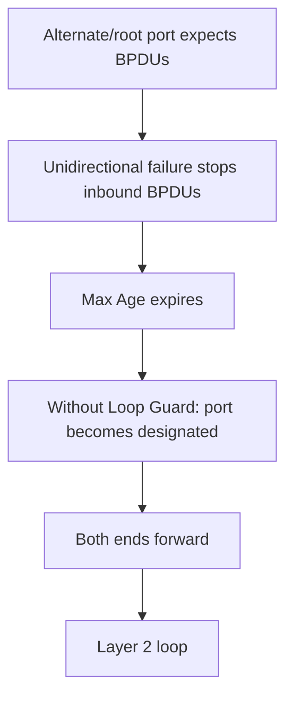
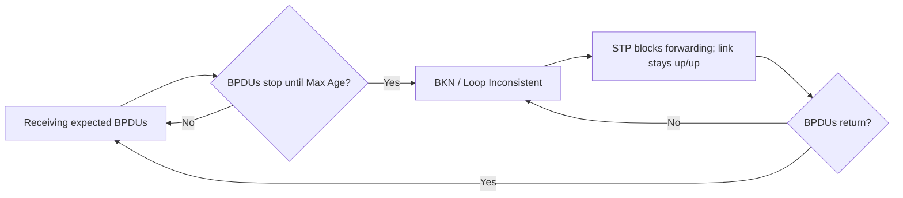
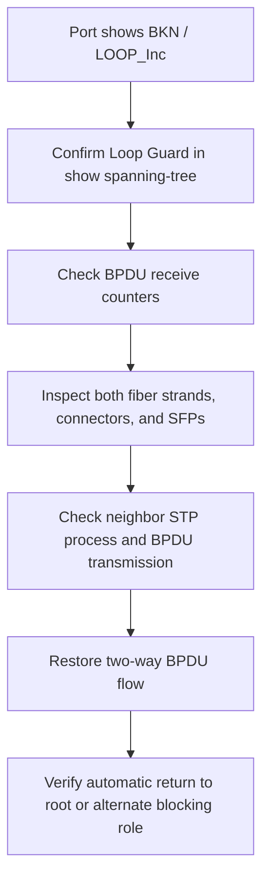

# Loop Guard: Unidirectional Link Protection

> [!summary]
> **Loop Guard** prevents a root or non-designated port from incorrectly becoming designated and forwarding when expected BPDUs disappear. Instead, the port enters the **Broken / Loop Inconsistent** state. This protects against Layer 2 loops caused by undetected unidirectional links or a neighbor that stops sending BPDUs.

## Unidirectional links

A **unidirectional link** carries traffic in only one direction. For example, SW1 can transmit to SW2, but SW2 cannot transmit back to SW1.

Common causes include:

- Damaged cables
- Faulty connectors
- Failed SFP or other transceiver modules
- A software defect that prevents a switch from sending BPDUs
- Physical damage to one strand of a fiber pair

Unidirectional failures are more common on fiber than copper because a typical fiber connection uses two separate strands:

```text
Fiber 1: SW1 Tx -----------------> SW2 Rx
Fiber 2: SW1 Rx <----------------- SW2 Tx
```

Damage to one strand can break one direction while leaving the other direction functional.

Normally, both devices detect the loss and take their interfaces down. The dangerous condition occurs when the physical problem is not detected and both interfaces remain `up/up` despite one-way communication.

## How a unidirectional link can defeat STP

Consider a redundant triangle:

- SW1 is the root bridge.
- SW2 has a designated forwarding port toward SW3.
- SW3 has a non-designated or alternate blocking port toward SW2.
- SW3 keeps that port blocked because it receives superior BPDUs from SW2.

If the link becomes unidirectional and SW2's BPDUs can no longer reach SW3:

1. SW3's stored BPDU information ages out.
2. SW3 assumes no superior switch exists on that segment.
3. SW3 changes the blocked port to designated.
4. The port begins transitioning toward forwarding.
5. SW2 ignores SW3's inferior BPDUs and keeps its own port forwarding.
6. Both ends forward, completing a Layer 2 loop through SW1, SW2, and SW3.

Broadcast and unknown-unicast frames can then circulate indefinitely.



## How Loop Guard solves the problem

When a Loop Guard-enabled port's BPDU information reaches Max Age:

1. The port does not become designated.
2. It enters **Broken (`BKN`) / Loop Inconsistent (`LOOP_Inc`)**.
3. STP blocks data forwarding on the interface.
4. The physical interface remains `up/up`.
5. The switch continues monitoring for BPDUs.
6. When valid BPDUs return, STP automatically removes the inconsistent condition.



> [!important]
> Loop Guard does not physically shut the port or put it into ErrDisable. The interface remains up, but STP prevents it from forwarding until BPDUs return.

## Where Loop Guard belongs

Enable Loop Guard on ports that are expected to **receive BPDUs continuously**:

- Root ports
- Non-designated or alternate ports
- Redundant switch-to-switch links where loss of BPDUs could incorrectly cause forwarding

Loop Guard is not primarily intended for designated ports, because designated ports are expected to send superior BPDUs rather than rely on receiving them.

> [!tip] Placement question
> Ask, "Should this port keep receiving BPDUs to preserve its current root or alternate role?" If yes, Loop Guard may be appropriate.

## Configuration

### Enable on one interface

```cisco
interface g0/1
 spanning-tree guard loop
```

### Enable globally

```cisco
spanning-tree loopguard default
```

The global command enables Loop Guard by default on switch ports. Its protection becomes relevant on ports whose current STP role expects to receive BPDUs.

### Disable on one interface

```cisco
interface g0/1
 spanning-tree guard none
```

Use the per-interface exception when the global default is enabled but Loop Guard is inappropriate for a specific port.

## Verification

### Verify one interface

```cisco
show spanning-tree interface g0/1 detail
```

Look for:

```text
Loop guard is enabled on the port
```

With the global default, output may show:

```text
Loop guard is enabled on the port by default
```

The detailed view also shows the port role, state, BPDU counters, timers, and designated bridge information.

### Identify a Loop Inconsistent port

```cisco
show spanning-tree
```

Example:

```text
Interface  Role  Sts  Cost  Prio.Nbr  Type
Gi0/1      Desg  BKN  4     128.2     P2p *LOOP_Inc
```

Interpretation:

- `BKN`: Broken; STP is blocking the port.
- `LOOP_Inc`: Loop Inconsistent because expected BPDUs stopped arriving.
- The port may temporarily appear as `Desg`, but Loop Guard prevents it from forwarding.

The switch may log:

```text
Loop guard blocking port GigabitEthernet0/1 on VLAN0001
```

## Automatic recovery

When valid BPDUs begin arriving again, Loop Guard automatically clears the inconsistent state.

Expected log message:

```text
Loop guard unblocking port GigabitEthernet0/1 on VLAN0001
```

After recovery, the port returns to its correct STP role, such as:

```text
Gi0/1  Altn  BLK  4  128.2  P2p
```

The port does not need a manual `shutdown` / `no shutdown` reset. Repair the physical link, transceiver, or BPDU-sending problem and allow STP to recover.

## Loop Guard and Root Guard

Loop Guard and Root Guard are **mutually exclusive**. They cannot be active on the same interface at the same time.

| Feature | Expected port role | Prevents the port from... | Trigger |
|---|---|---|---|
| **Loop Guard** | Root or non-designated/alternate | Becoming designated and forwarding | Expected BPDUs disappear |
| **Root Guard** | Designated | Becoming a root port | A superior BPDU arrives |

If one interface-level command is entered after the other, the newer configuration replaces the previous guard mode:

```cisco
spanning-tree guard loop
spanning-tree guard root
```

In this sequence, Root Guard replaces Loop Guard.

If Loop Guard is enabled globally and Root Guard is configured on one interface, the more specific interface configuration takes effect and Loop Guard is disabled on that port.

Example design:

- Root Guard on a designated port facing an external, untrusted switch domain
- Loop Guard on internal root and alternate ports that must keep receiving BPDUs

## Comparison with other STP protections

| Feature | Detects | Result |
|---|---|---|
| **BPDU Guard** | Any BPDU on a protected edge port | Error-disables the interface |
| **Root Guard** | A superior BPDU where the root must not appear | `BKN / ROOT_Inc` |
| **Loop Guard** | Loss of expected BPDUs | `BKN / LOOP_Inc` |

Memory aid:

- **BPDU Guard:** "An edge port heard a switch."
- **Root Guard:** "A better root appeared where it should not."
- **Loop Guard:** "Expected BPDUs disappeared, so do not start forwarding."

## Troubleshooting workflow



## Command reference

| Goal | Command |
|---|---|
| Enable Loop Guard on one port | `spanning-tree guard loop` |
| Enable Loop Guard globally | `spanning-tree loopguard default` |
| Disable guard mode on one port | `spanning-tree guard none` |
| Verify one port in detail | `show spanning-tree interface interface-name detail` |
| Find Loop Inconsistent ports | `show spanning-tree` |

## Exam traps and practical takeaways

- A unidirectional link carries traffic in only one direction.
- Fiber is especially susceptible because transmit and receive commonly use separate strands.
- The dangerous failure leaves interfaces `up/up` while one direction no longer works.
- A root or alternate port may become designated if expected BPDUs age out.
- If both ends then forward, a Layer 2 loop can form.
- Loop Guard keeps the port in `BKN / LOOP_Inc` instead.
- The physical interface remains up; STP blocks forwarding.
- Recovery is automatic when BPDUs return.
- Apply Loop Guard to root and non-designated/alternate ports that should receive BPDUs.
- Per-interface command: `spanning-tree guard loop`.
- Global command: `spanning-tree loopguard default`.
- Interface exception: `spanning-tree guard none`.
- Loop Guard and Root Guard cannot be enabled together on the same port.
- An interface-level guard setting overrides the global Loop Guard default.

## Related notes

- [Root Guard - Root Bridge Protection](<Root Guard - Root Bridge Protection.md>)
- [BPDU Guard, BPDU Filter, and ErrDisable](<BPDU Guard, BPDU Filter, and ErrDisable.md>)
- [PortFast - Edge Ports and Configuration](<PortFast - Edge Ports and Configuration.md>)
- [STP Part 2 - Port States, Timers, Toolkit, and Configuration](<STP Part 2 - Port States, Timers, Toolkit, and Configuration.md>)
- [STP Part 1 - Redundancy, Root Bridge, and Port Roles](<STP Part 1 - Redundancy, Root Bridge, and Port Roles.md>)
