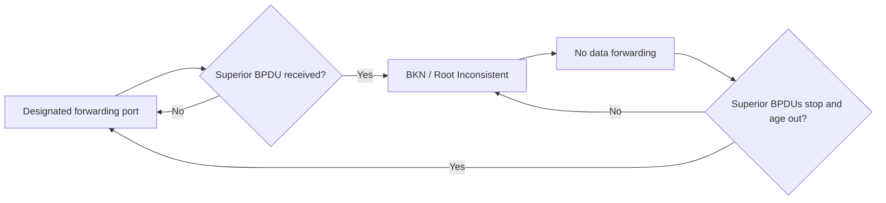

# Root Guard: Root Bridge Protection

> [!summary]
> **Root Guard** enforces the intended location of the STP root bridge. Configure it on interfaces where a superior BPDU should never arrive, such as a boundary toward a customer-controlled network. If a superior BPDU is received, the interface enters the **Broken / Root Inconsistent** state and stops forwarding. It automatically recovers after superior BPDUs stop arriving and the stored information ages out.

## Root bridge placement matters

STP prevents loops by electing one root bridge and ensuring that each non-root switch has one valid best path toward it. The root should be chosen deliberately rather than left to the default election.

Consider:

- **Traffic flow:** place the root near important network paths.
- **Latency:** avoid unnecessary detours.
- **Congestion:** prevent traffic from crossing low-capacity or external links unnecessarily.
- **Stability:** use a reliable, centrally managed switch.
- **Predictability:** configure a deliberate primary and secondary root.

Poor root placement can force traffic to take an indirect path and create avoidable congestion.

## The problem Root Guard solves

Inside a single administrative domain, bridge priority can be configured to control the root election. However, an enterprise or service-provider network may connect to switches outside its control, such as:

- A customer switch connected to a Metro Ethernet service
- A partner or tenant network
- A managed demarcation point
- A downstream access network administered by another team

If that external switch advertises a superior Bridge ID, internal switches may accept it as the new root. Even an internal priority of `0` is not an absolute guarantee if the external switch uses the same priority and has a lower MAC address.

Consequences can include:

- An external or customer switch becoming the root bridge
- Internal traffic detouring through the external network
- Increased latency or congestion
- Unexpected root and designated port changes
- Reduced topology stability

## Superior BPDUs

A **superior BPDU** advertises information that wins earlier in the STP comparison process. A common example is a better root Bridge ID:

1. Lower root bridge priority
2. If tied, lower root bridge MAC address

Without Root Guard, a switch accepts superior information and recalculates the spanning-tree topology.

## How Root Guard works

Configure Root Guard on a port where the root bridge must never be reachable.

When the port receives a superior BPDU:

1. The switch refuses to accept the neighbor as the path to a better root.
2. The interface enters **Broken (`BKN`) / Root Inconsistent (`ROOT_Inc`)**.
3. The port stops forwarding and discards received data frames.
4. The protected root bridge remains in the intended administrative domain.
5. The switch continues monitoring STP so it can detect when the superior BPDUs stop.



> [!important]
> Root Guard is not a permanent shutdown and does not place the interface into Cisco's ErrDisable state. The condition is STP-specific and automatically clears when superior root information is no longer present.

## Where to configure Root Guard

Good candidates are **designated ports facing a network that must never provide the root bridge**, including service-provider-to-customer boundaries.

Do not place Root Guard on a link where that interface may legitimately need to become a root port. Root Guard's purpose is to enforce the rule: **the root must not be reached through this port**.

> [!tip] Design question
> Ask, "Could the legitimate root bridge ever be on the other side of this interface?" If yes, Root Guard is probably inappropriate there. If no, the interface may be a good candidate.

## Configuration

Root Guard is configured per interface:

```cisco
interface g0/2
 spanning-tree guard root
```

There is no global command that enables Root Guard by default on a class of ports.

The command applies Root Guard to the VLAN instances active on that interface.

## Verification

```cisco
show spanning-tree
```

When a superior BPDU is being blocked, output can show:

```text
Interface  Role  Sts  Cost  Prio.Nbr  Type
Gi0/2      Desg  BKN  4     128.3     P2p *ROOT_Inc
```

Interpretation:

- `Desg`: the interface is still conceptually the designated side of the protected boundary.
- `BKN`: Broken state; it is not forwarding.
- `ROOT_Inc`: Root Inconsistent because a superior BPDU was received.

The switch may also log:

```text
Root guard enabled on port GigabitEthernet0/2
Root guard blocking port GigabitEthernet0/2 on VLAN0001
```

## Automatic recovery

To restore the port, fix the external root-election problem. For example:

- Increase the external switch's bridge priority value.
- Remove an accidental low-priority configuration.
- Stop the external device from advertising superior BPDUs.
- Correct the physical connection if the wrong networks were joined.

Once superior BPDUs stop arriving, their information ages out. The default BPDU Max Age shown in the deck is **20 seconds**. The port then automatically returns to its normal forwarding role.

Expected log message:

```text
Root guard unblocking port GigabitEthernet0/2 on VLAN0001
```

After recovery, `show spanning-tree` should show the interface forwarding again:

```text
Gi0/2  Desg  FWD  4  128.3  P2p
```

> [!note]
> Manual `shutdown` / `no shutdown` and ErrDisable Recovery are not the normal recovery mechanisms for Root Guard. Remove the superior BPDU source and allow STP to recover automatically.

## Root Guard versus BPDU Guard

| Feature | Trigger | Result | Recovery | Typical placement |
|---|---|---|---|---|
| **Root Guard** | A **superior** BPDU | `BKN / ROOT_Inc`; blocks forwarding | Automatic after superior BPDUs stop and age out | Switch boundary where the root must not appear |
| **BPDU Guard** | **Any** BPDU on a protected edge port | Interface becomes error-disabled | Manual reset or configured ErrDisable Recovery after fixing the cause | PortFast end-host ports |

Root Guard allows ordinary non-superior BPDUs and keeps the neighbor in STP, but prevents that neighbor from offering a better root. BPDU Guard treats any BPDU as an edge-port violation and shuts the interface down.

## Root Guard versus Loop Guard

| Feature | Protects against | Applied where |
|---|---|---|
| **Root Guard** | Unexpectedly receiving superior BPDUs | Designated ports where the root must never be located downstream |
| **Loop Guard** | Unexpectedly stopping receipt of BPDUs | Non-designated/root-facing redundant links that should continue hearing BPDUs |

A useful memory aid:

- **Root Guard:** "A better root appeared where it should not."
- **Loop Guard:** "Expected BPDUs disappeared, so do not start forwarding."

## Example boundary design

Suppose a service provider has selected SW1 as its internal root. Customer switches attach through SW2 G0/2 and SW3 G0/2.

```cisco
! SW2
interface g0/2
 spanning-tree guard root

! SW3
interface g0/2
 spanning-tree guard root
```

If the customer advertises a superior Bridge ID:

- SW2 G0/2 and SW3 G0/2 enter Root Inconsistent.
- The customer is prevented from becoming the service provider's root.
- Internal STP roles remain based on SW1 as root.
- After the customer corrects its priority and superior information ages out, both ports recover automatically.

## Command reference

| Goal | Command |
|---|---|
| Enable Root Guard | `spanning-tree guard root` |
| View port roles and inconsistent state | `show spanning-tree` |
| Inspect one interface in detail | `show spanning-tree interface interface-name detail` |

## Exam traps and practical takeaways

- Root bridge placement should optimize traffic flow, latency, congestion, and stability.
- An external switch can win the root election if it advertises a superior Bridge ID.
- Priority `0` alone does not beat another priority `0`; the lower MAC address breaks the tie.
- Root Guard belongs on ports where the root bridge must never be found.
- Root Guard is configured per interface; there is no global default command.
- Only a **superior** BPDU triggers Root Guard.
- The triggered state is `BKN / ROOT_Inc`, not ErrDisable.
- A Root-Inconsistent port does not forward data frames.
- Recovery is automatic after superior BPDUs stop and their information ages out.
- The default Max Age in the deck is 20 seconds.
- Root Guard and BPDU Guard solve different problems: root placement versus unauthorized switches on edge ports.
- Root Guard reacts to receiving superior BPDUs; Loop Guard reacts to expected BPDUs disappearing.

## Related notes

- [BPDU Guard, BPDU Filter, and ErrDisable](<BPDU Guard, BPDU Filter, and ErrDisable.md>)
- [PortFast - Edge Ports and Configuration](<PortFast - Edge Ports and Configuration.md>)
- [STP Part 2 - Port States, Timers, Toolkit, and Configuration](<STP Part 2 - Port States, Timers, Toolkit, and Configuration.md>)
- [STP Part 1 - Redundancy, Root Bridge, and Port Roles](<STP Part 1 - Redundancy, Root Bridge, and Port Roles.md>)
